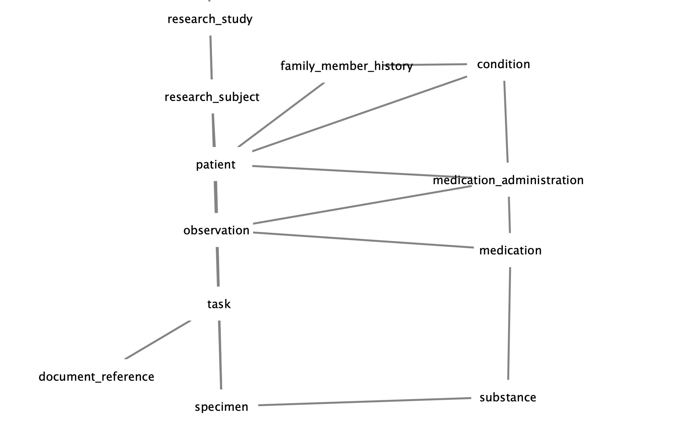

# iceberg
A clearinghouse for schemas 

> "I always try to write on the principle of the iceberg. There is seven-eighths of it underwater for every part that shows." ~ Ernest Hemingway

## overview

## simplified schema

## schema

* in: we need to be able to read
  * FHIR
  * OMOP
  * Pheno Packets
  * Bridge-to-AI (linkml)
  * TSV

* out: we need to be able to write
  * Grip, json-schema
  * Gen3, flat and graph
  * OMOP
  * TSV
  
## data

* in: we need to be able to read
  * FHIR
  * OMOP
  * Pheno Packets
  * Bridge-to-AI (linkml)
  * TSV

* out: we need to be able to write
  * vertex.ndjson
  * edge.ndjson
  * pfb
  * TSV
  
## controls

* manifests
* bucket naming conventions
* semantic versioning

Iceberg will organize projects or data submissions by source. (e.g. "bucket/my-lab/my-study/Patient.ndjson, etc.")

## central storage
 
* schemas: will be stored as `json schema with edge vocabulary extensions` (eg. backref name, destination type)
* data: ndjson files of entities that fulfill those schemas. (schema and entities will have embedded edge references, __not__ separate entity files.)

## out of scope

* loading
* building
* denormalization

## usage

> In general, iceberg does not concern itself with the extraction and transformation of data from sources - as long as the resulting data and schema is self contained.

> A iceberg user should be able to move towards loading a given data base without referring to how the data was harvested and stored.

> This repo should limit itself to central schemas.  Tooling, submission and manifest repos will refer to this to retrieve schemas definitions.

